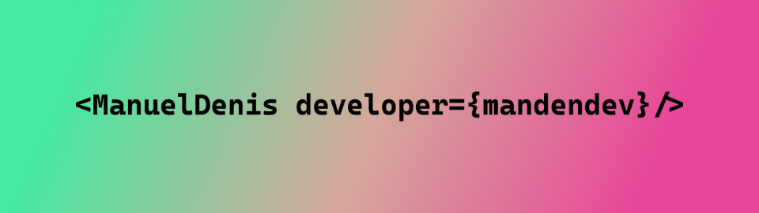

<figure style="background-image: linear-gradient(180deg, #ffffe0 0, #feffdc 8.33%, #f3ffd7 16.67%, #e6ffd3 25%, #d8fbcf 33.33%, #c7f7cc 41.67%, #b5f2c9 50%, #a1edc8 58.33%, #8de9c9 66.67%, #79e4cc 75%, #63e0d0 83.33%, #4bddd6 91.67%, #2fd9dd 100%);padding:100px;">
 
</figure>
<h1 style="margin-top: 100px">
    Clone de Spotify
</h1>

Enlace al proyecto <a href="https://manueldenis-spotify.netlify.app/">manueldenis-spotify</a>

Enlace al portafolio de <a href="https://manueldenis.netlify.app/">Manuel Denis Developer</a>

</img>

## 🛠️ Stack

- [**Astro**](https://astro.build/) - El framework web de la nueva época.
- [**Typescript**](https://www.typescriptlang.org/) - JavaScript con sintaxis de tipado.
- [**TailwindCSS**](https://tailwindcss.com/) - Un framework CSS para diseñar aplicaciones web.
- [**shadcn/ui**](https://shadcn-ui.vercel.app/) - Un conjunto de componentes de interfaz de usuario para React.
- [**React**](https://reactjs.org/) - Biblioteca de JavaScript para construir interfaces de usuario.
- [**Svelte**](https://svelte.dev/) - Un marco de trabajo web para construir interfaces de usuario.
- [**Zustand**](https://zustand.surge.sh/) - Un estado global mínimo para React.
